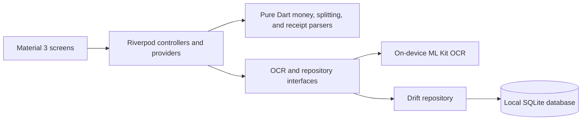

# SplitLens

[](https://github.com/growithanand/SplitLens/actions/workflows/flutter-ci.yml)

**Status: In Development (v0.1)**

SplitLens is an Android application that turns printed receipt photos and
screenshots into editable, locally stored group expenses.

Manually entering receipt information when splitting shared expenses is slow
and error-prone. SplitLens uses on-device OCR to propose receipt details while
keeping the user in control of every value before anything is saved.

## Current workflow

```text
Receipt photograph or screenshot
→ on-device OCR
→ raw text
→ merchant/date/currency/total proposals
→ editable user review
→ participant and payer selection
→ exact equal split
→ transactional SQLite save
→ local history and expense details
```

OCR output is never treated as trusted financial data. Merchant, date,
currency, and total remain editable and require explicit confirmation.

## Implemented features

| Capability | Current status |
| --- | --- |
| Android Material 3 interface | Implemented |
| Camera receipt capture | Implemented |
| Gallery and screenshot selection | Implemented |
| On-device Latin-script OCR with Google ML Kit | Implemented |
| Raw OCR inspection | Implemented |
| English and German receipt parsing | Implemented |
| EUR, `€`, decimal comma, and decimal point support | Implemented |
| Editable merchant, date, currency, and total review | Implemented |
| Participant and payer selection | Implemented |
| Integer-cent equal splitting with deterministic remainders | Implemented |
| Transactional local persistence with Drift and SQLite | Implemented |
| Private app-owned receipt image storage | Implemented |
| Local expense history | Implemented |
| Expense details, allocations, receipt image, and raw OCR | Implemented |
| Loading, empty, validation, and retryable error states | Implemented |

## Technology

- Flutter and Dart
- Material 3
- Riverpod for state management and dependency injection
- Google ML Kit Text Recognition for on-device OCR
- Image Picker for camera and gallery input
- Drift with SQLite for local persistence
- `intl` for date and EUR formatting
- UUIDs for local record identifiers
- Flutter unit, database, and widget tests

No backend, account, cloud storage, or network synchronization is part of v0.1.

## Architecture

SplitLens uses a feature-oriented structure with UI, application state, domain
logic, and device integrations kept distinguishable.



```text
lib/
├── app/                         # Application, navigation, and theme
├── core/                        # Money, splitting, parsing, and utilities
├── data/                        # Drift database and repositories
└── features/
    ├── receipt_capture/         # Image selection and OCR
    ├── receipt_review/          # Editable OCR proposals
    ├── expense_split/           # Manual equal-split workflow
    ├── expense_confirmation/    # Participants, payer, and persistence
    ├── expense_history/         # Saved expense list
    └── expense_detail/          # Saved allocations and evidence
```

Important design decisions:

- Currency values use integer cents, never floating-point arithmetic.
- Allocation remainders are assigned deterministically, and allocations must
  always sum exactly to the original total.
- OCR and receipt interpretation are separate. Parsing is deterministic and
  tested with synthetic receipts.
- OCR and persistence sit behind interfaces so tests do not depend on device
  services.
- An expense, its participants, and its allocations are saved in one database
  transaction.

## Local data model

The Drift database currently contains:

- `expenses`: confirmed receipt data, payer, local receipt reference, raw OCR,
  and timestamps
- `participants`: locally identified participant names
- `expense_allocations`: exact integer-cent allocations joining expenses and
  participants

The database schema starts at version 1 and is ready for explicit migrations as
the local model evolves.

## Supported receipts

The v0.1 parser is designed for:

- Printed English and German receipts
- Latin-script text
- EUR totals represented by `EUR` or `€`
- Dates in `dd.MM.yyyy`, `dd/MM/yyyy`, or `yyyy-MM-dd` format
- Common total labels such as `TOTAL`, `GRAND TOTAL`, `GESAMT`, `SUMME`,
  `BETRAG`, and `ZAHLBETRAG`

Ambiguous or missing proposals remain blank or uncertain for manual review.

## Privacy

- Receipt text recognition runs on the Android device.
- SplitLens does not send receipt images to an external OCR API.
- Confirmed expenses, raw OCR text, and receipt-image references are stored
  locally. Receipt images are copied into private SplitLens application storage
  when an expense is saved.
- The repository contains synthetic test data only.
- Real receipts containing addresses, card details, or transaction identifiers
  must not be committed to the repository.

## Requirements

- Windows, macOS, or Linux with a Flutter-compatible development environment
- Flutter stable with Dart 3.13.2 or a compatible later Dart 3 release
- Android Studio and an installed Android SDK
- An Android emulator or physical Android device

The current project has been verified with Flutter 3.47.2, Dart 3.13.2, and an
Android 16 emulator.

## Setup

Clone the repository and install dependencies:

```powershell
git clone https://github.com/growithanand/SplitLens.git
cd SplitLens
flutter pub get
```

Generate Drift code after changing database tables:

```powershell
dart run build_runner build
```

The generated `lib/data/database/app_database.g.dart` file is committed so a
fresh checkout can be analyzed and built before code generation is needed.

Check available Android targets and run the app:

```powershell
flutter devices
flutter run -d <device-id>
```

## Android release signing

Release builds use a private upload key and are never signed with Flutter's
debug key. Generate the key outside this repository so it cannot be committed:

```powershell
keytool -genkeypair -v `
  -keystore "<secure-path-outside-repository>\splitlens-upload-key.p12" `
  -storetype PKCS12 -keyalg RSA -keysize 2048 -validity 10000 -alias upload
```

Create the ignored local signing configuration from the committed template:

```powershell
Copy-Item android/key.properties.example android/key.properties
```

Replace every placeholder in `android/key.properties`. On Windows, use double
backslashes in the `storeFile` path. Neither `key.properties` nor keystore
files should be committed. Then create the Play Store upload bundle:

```powershell
flutter build appbundle --release
```

## Quality checks

Run the same core checks used during development:

```powershell
dart format --output=none --set-exit-if-changed .
flutter analyze
flutter test
flutter build apk --debug
```

The automated suite covers money parsing, exact splitting, English and German
receipt parsing, state transitions, database constraints and transactions,
repository behavior, and selected screen flows.

## Demonstration flow

1. Start SplitLens on an Android device or emulator.
2. Select a clearly synthetic or anonymized receipt image.
3. Run on-device text recognition.
4. Inspect the raw OCR output.
5. Review or correct merchant, date, EUR currency, and total.
6. Add participants and choose who paid.
7. Verify the exact allocations and save the expense.
8. Close and reopen the application.
9. Open expense history and select the saved expense.
10. Inspect participant allocations and receipt evidence.

Public screenshots and a short demo video are planned before the v0.1 release.
Only synthetic or fully anonymized receipts will be used.

## Known limitations

- Android is the only supported platform in v0.1.
- Only EUR expenses are supported.
- OCR and parser quality depends on image clarity and receipt layout.
- Handwritten and non-Latin receipts are outside the current scope.
- Saved expenses are currently read-only; editing and deletion are not
  implemented.
- There is no authentication, backend, cloud backup, shared group, or
  synchronization.
