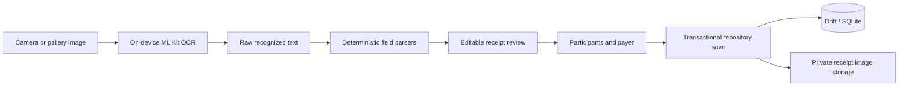

# SplitLens Architecture

This document describes the architecture of the SplitLens v0.1.0 Android MVP
checkpoint. It records the boundaries and invariants that should remain clear
if development resumes in a later release.

## Product boundary

SplitLens is a local-first receipt review and equal-expense-splitting app. The
v0.1.0 workflow is deliberately narrow:

1. Select or photograph a receipt.
2. Recognize its text on the Android device.
3. Propose receipt fields using deterministic parsers.
4. Let the user review and correct every field.
5. Add participants and choose the payer.
6. Calculate exact allocations.
7. Persist the confirmed expense and its evidence locally.
8. Search, inspect, or delete saved expenses.

The checkpoint has no account, backend, cloud storage, synchronization, or
shared-group model. These are scope boundaries rather than partially wired
features.

## Structure

The project combines a feature-oriented layout with explicit responsibility
layers:

```text
lib/
|-- app/                         Application shell, navigation, and theme
|-- core/                        Money, allocation, parsing, and identifiers
|-- data/                        Drift database and repository implementation
`-- features/
    |-- receipt_capture/         Image selection, recovery, storage, and OCR
    |-- receipt_review/          Parsed proposals and explicit user review
    |-- expense_split/           Participant entry and equal allocations
    |-- expense_confirmation/    Payer selection and transactional save
    |-- expense_history/         Local listing and search
    `-- expense_detail/          Evidence, allocations, and safe deletion
```

Presentation widgets render immutable state and forward user intent to
Riverpod controllers. Controllers coordinate use cases. Domain types and pure
utilities enforce business rules. Device and database integrations implement
small interfaces so controller and widget tests can use fakes.

## Receipt data flow



OCR output is evidence, not trusted financial data. The parsers may return a
reliable proposal, uncertain alternatives, or no proposal. Merchant, date,
currency, and total remain editable, and the reviewed values must pass
validation before the expense can continue.

The total parser ranks candidates associated with supported English and German
labels. It excludes common subtotal, tax, tendered-cash, and change lines, and
can recognize totals printed on the same line, a following line, or at the end
of a column-like group. An ambiguous result stays uncertain for user review.

## Financial invariants

- Monetary values are represented as integer euro cents.
- No expense calculation uses binary floating-point currency values.
- An equal split always has at least one participant.
- Every allocation is deterministic.
- Remainder cents are assigned in participant order.
- The allocation sum must exactly equal the confirmed receipt total.
- The selected payer must be one of the allocated participants.

These rules are enforced in pure Dart logic and checked again at the repository
boundary before persistence.

## Persistence

`AppDatabase` uses Drift over a local SQLite database with foreign-key
enforcement enabled. Schema version 1 contains:

- `expenses` for the reviewed receipt, payer reference, evidence paths, and
  timestamps
- `participants` for the participants belonging to a saved expense
- `expense_allocations` for the exact amount assigned to each participant

Saving an expense inserts its participants, expense, and allocations inside a
single database transaction. The selected receipt is first copied into private
application storage; if the database save fails, the repository attempts to
remove that copied file.

Deletion removes the database record transactionally and then cleans up the
private receipt image. Cleanup failure is reported separately so the UI can
truthfully state that the financial record was deleted even if file cleanup
needs attention.

Drift's generated implementation is committed. The versioned schema snapshot
under `drift_schemas/` is regenerated in CI, preventing an uncommitted or stale
schema definition from passing verification.

## State and navigation

Riverpod providers create the production database, image storage, OCR, and
repository dependencies. Auto-disposed controller families keep state scoped
to individual receipt-review and expense flows. The application uses named
routes for its top-level screens and typed constructor data for the later
workflow stages.

## Verification boundary

The automated suite covers:

- money parsing and integer-cent arithmetic
- equal-split invariants and remainder behavior
- merchant, date, currency, and total parsing
- receipt capture, recognition, review, confirmation, and history state
- Drift constraints, transactions, repository reads, and deletion behavior
- representative screen flows, validation states, and responsive layouts

GitHub Actions installs the pinned Flutter toolchain, regenerates the Drift
schema snapshot, checks formatting, runs static analysis and tests, and builds
an Android debug APK. Release bundles require the ignored local signing
configuration documented in the README.

## Safe extension points

Later releases can add receipt formats, currencies, allocation strategies, or
repository implementations behind the existing parser, money, splitting, and
persistence boundaries. Database changes must increment the schema version,
define a migration, regenerate code and schema snapshots, and add migration
tests before persisted user data is considered safe.
